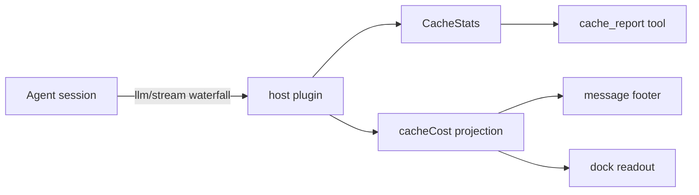

# 🧮 dsh-cache-cost-monitor

> Know exactly where every DeepSeek cent goes — prefix-cache hit rate, cost, and health, at a glance.

A [Cordis](https://github.com/cordiverse/cordis) plugin for DSH (DeepSeek Harness) v0.1.x that taps every agent model call, extracts `prompt_cache_hit_tokens` / `prompt_cache_miss_tokens` / `completion_tokens`, and turns them into real-time hit-rate stats, cost estimates (with official PEAK/OFF-PEAK pricing), and a cache **health grade**.

[](LICENSE)


---

## Features

| | Feature | Description |
| --- | --- | --- |
| 📊 | **`cache_report` tool** | One-line summary (hit rate / cost / health) + trend **sparkline** + per-model breakdown + 3 targeted optimization tips |
| 🏆 | **Health grade** | Cumulative hit rate → S/A/B/C/D with 🟢🟡🟠🔴 |
| 🖥️ | **Live dock readout** | Under the composer: `⌀ 1.2M tokens · ¥2.01 · hit 68% ▂▅▇█`, updates every turn |
| 📝 | **Message footer** | Each assistant reply ends with `12.3K tokens · ¥0.0123` (hover for details) |
| ⏱️ | **Peak/off-peak billing** | Auto-detects official DeepSeek windows (UTC 00:30–16:30 PEAK) |
| 💰 | **Cost budget** | Set `budgetUsd`; gets an alert + ⚠️ flag in the report when exceeded |
| 🚨 | **Threshold alerts** | Warn log when hit rate drops below config (debounced) |
| 🛡️ | **Graceful degradation** | Missing fields, unpriced models, unavailable services — logs only, never crashes |

## Architecture



Only public DSH extension seams: `llm/stream`, `tools`, `sessionProjections`, conversation slots. No private APIs.

## Install

Prereqs: Node >= 18, pnpm, DSH v0.1.x.

```powershell
# from GitHub (repo = release source)
dsh plugin --profile web add https://github.com/eurt-nano/dsh-cache-cost-monitor.git#v0.3.0 --config.node-linker=isolated

# or local checkout
cd dsh-cache-cost-monitor
npm install && npm run build && npm test
powershell -ExecutionPolicy Bypass -File scripts\install-profile.ps1
```

> Windows note: keep `--config.node-linker=isolated` (pnpm workspace link bug with absolute drive paths). For git installs, add `dsh-cache-cost-monitor` to `allowBuilds` in the profile's `pnpm-workspace.yaml` if pnpm blocks the build script.

Restart DSH (`dsh web`) and refresh the browser page.

## Usage

- Ask the agent to call `cache_report` (optional args: `{ "detail": true, "limit": 10 }`).
- Watch the dock readout and per-message footers.
- Check `[cache-monitor]` logs for alerts.

## Config (`cordis.patch.yml`)

| Key | Default | Description |
| --- | --- | --- |
| `threshold` | `0.3` | Per-round hit-rate alert threshold |
| `cumulativeThreshold` | `0.3` | Cumulative hit-rate alert threshold |
| `historySize` | `20` | Trend window rounds |
| `warnOnMissingUsage` | `true` | Debug-log when usage is missing |
| `timeBilling` | `auto` | `auto` / `peak` / `off-peak` |
| `currency` | `both` | `USD` / `CNY` / `both` |
| `usdCnyRate` | `6.8` | USD → CNY rate |
| `budgetUsd` | unset | Optional cost budget; alerts + flags when exceeded |
| `pricing` | official | Per-model rates (USD per 1M tokens), `peak` tier supported |

Built-in pricing (cacheHit / cacheMiss / output): deepseek-v4-flash `0.007 / 0.22 / 0.66` (PEAK `0.014 / 0.44 / 1.32`), deepseek-v4-pro `0.022 / 0.66 / 1.98` (PEAK `0.044 / 1.32 / 3.96`), plus deepseek-chat / deepseek-reasoner. Unpriced models cost 0 and are flagged.

## Health grades

| Grade | Hit rate | Meaning |
| --- | --- | --- |
| S | ≥ 85% | Excellent |
| A | ≥ 70% | Good |
| B | ≥ 50% | Moderate — room to improve |
| C | ≥ 30% | Low — cache often invalidated |
| D | < 30% | Poor — nearly no hits |

## FAQ

- **Data lifetime**: in-process totals reset on DSH restart; per-message footers come from session projections and survive.
- **No footer?** Only rounds after install that carried usage data; turns that produced files yield to the official "Produced" row.
- **Cost exactness?** Estimate = configured rates × real tokens; no discounts/retries/gateway markup.

## Roadmap

- [ ] Persistent cross-session totals
- [ ] Report export (Markdown / CSV / JSON)
- [ ] Cache-invalidation cause diagnosis
- [ ] Alert channels (webhook / desktop)
- [ ] Customizable peak windows

## Contributing

```powershell
npm run build   # tsc host + tsdown client
npm test        # keep the smoke suite green
```

## License

MIT © 2026 eurt-nano

**中文 README**：[README.md](README.md)
